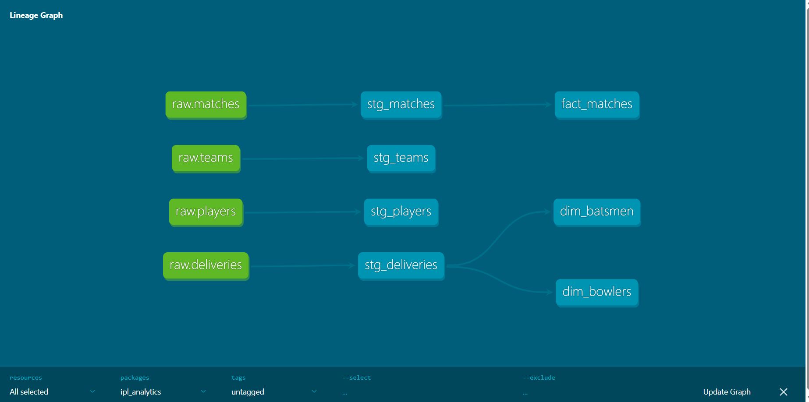
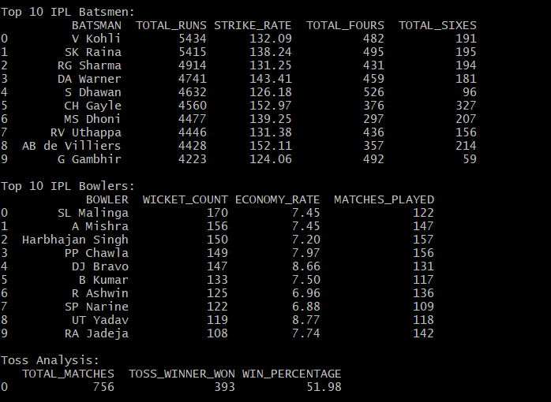

# IPL Cricket Analytics Pipeline

## Overview
An end-to-end cricket analytics pipeline built on Snowflake and dbt Core, analyzing 179,000+ ball-by-ball IPL deliveries to uncover player performance insights, team statistics, and match trends.

## Architecture
Raw CSVs → Snowflake Stage → COPY INTO → Raw Layer
↓

dbt Staging Layer
(stg_matches, stg_deliveries,
stg_players, stg_teams)
↓

┌───────────────┼───────────────┐

dim_batsmen      dim_bowlers        fact_matches

## Tech Stack
- **Snowflake** — Cloud data warehouse
- **dbt Core** — Layered SQL transformations and data quality tests
- **Python** — Snowflake connector for programmatic analysis
- **Git** — Version control

## Dataset
- 758 IPL matches across all seasons
- 179,078 ball-by-ball delivery records
- 566 players across 15 teams

## dbt Models

### Staging Layer
| Model | Description |
|---|---|
| stg_matches | Cleaned match results with date casting |
| stg_deliveries | Ball-by-ball delivery data |
| stg_players | Player profiles with batting and bowling details |
| stg_teams | Team reference data |

### Marts Layer
| Model | Description |
|---|---|
| dim_batsmen | Batsman performance — runs, strike rate, boundaries |
| dim_bowlers | Bowler performance — wickets, economy rate |
| fact_matches | Match results with toss analysis and win type |

## Key Insights
- **Top run scorer:** Virat Kohli
- **Top wicket taker:** Lasith Malinga
- **Toss advantage:** Teams winning the toss win 51.98% of matches — barely better than chance

## Snowflake Features Used
- **COPY INTO** — Bulk loaded 179k+ rows from CSV files via internal stage
- **Virtual Warehouse** — X-Small compute with 1 minute auto-suspend
- **Time Travel** — Available for data recovery on all tables
- **Zero Copy Cloning** — Used for test environment setup
- **RBAC** — SYSADMIN role with schema level privileges
- **Query History** — Monitored via account_usage schema

## dbt Features Used
- Three layer architecture — raw, staging, marts
- 9 data quality tests — unique, not_null across all models
- Lineage documentation generated via dbt docs

## Lineage Graph


## Screenshots


## Project Structure
```
models/
├── staging/
│   ├── sources.yml
│   ├── stg_matches.sql
│   ├── stg_deliveries.sql
│   ├── stg_players.sql
│   └── stg_teams.sql
└── marts/
    ├── dim_batsmen.sql
    ├── dim_bowlers.sql
    └── fact_matches.sql
snowflake_connector.py
requirements.txt
```
